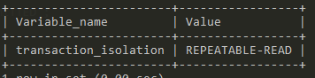
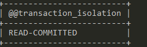

# 트랜잭션 격리 수준(Isolation level)

> 트랜잭션이 처리될 때, 트랜잭션 끼리 얼마나 서로 고립 되어 있는지 나타내는 것

- READ UNCOMMITTED
- READ COMMITTED
- REPEATABLE READ
- SERIALIZABLE

---

- 아래로 내려갈수록 고립 정도가 높아지고, 성능이 떨어짐
- 일반적인 온라인 서비스에서는 READ COMMITTED or REPEATABLE READ 중 하나 사용 (oracle = READ COMMITTED, mysql = REPEATABLE READ)

## ISOLATION LEVEL 조회, 변경



```mysql
SHOW VARIABLES like 'transaction_isolation';
--- or
SELECT @@transaction_isolation;
```

- MySQL 8 버전 이후 `tx_isolation` 에서 `transaction_isolation`으로 변경



```mysql
set autocommit = FALSE;
set transaction_isolation = 'READ-COMMITTED';
commit;
```

## READ UNCOMMITTED

> 어떤 트랜잭션의 변경내용이 COMMIT이나 ROLLBACK과 상관없이 다른 트랜잭션에서 보여짐

- A 트랜잭션에서 첫번째 유저가 별명을 AA -> BB로 변경
- 아직 커밋이 안됨
- B 트랜잭션에서 첫번째 유저의 별명을 조회
- BB가 조회됨
    - Dirty Read
- A 트랜잭션에 이슈가 생겨 ROLLBACK
- B 트랜잭션은 첫번째 유저의 별명을 BB로 생각하고 로직 수행

-> RDBMS 표준에서는 격리수준으로 인정안함

## READ COMMITTED

> 어떤 트랜잭션의 내용이 COMMIT 되어야만 다른 트랜잭션에서 조회할 수 있음

- B 트랜잭션에서 첫번째 유저의 별명 조회
- AA가 조회됨
- A 트랜잭션에서 첫번째 유저의 별명 AA -> BB로 변경 후 커밋
- B 트랜잭션에서 다시한번 조회
- BB가 조회됨

-> 이슈가 없는듯하지만 **트랜잭션내에서 똑같은 SELECT를 수행하면 같은 결과를 반환**해야 함 <br />

## REPEATABLE READ

> 트랜잭션이 시작되기 전에 커밋된 내용에 대해서만 조회 가능

