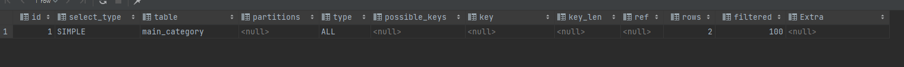
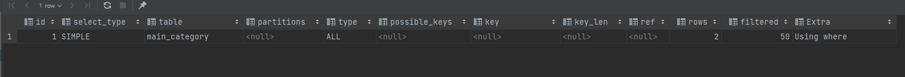

# MySQL Explain

> 쿼리 실행 계획

- 쿼리와 스키마 최적화
- 스키마는 모든 쿼리에 영향을 주기 때문에 변경이 어려움
- 쿼리는 해당 쿼리만 수정하면 되므로 변경이 쉬움

-> Slow Query를 없애 성능 향상

## 사용 방법

```sql
explain [extended] select ... from ... where ...
```


- `id`: select 구분 번호
- `select_type`: select에 대한 Type
    - `SIMPLE`: 단순 SELECT (Union 이나 Sub Query 가 없는 SELECT)
    - `PRIMARY`: 가장 바깥에 있는 SELECT 문을 말함
    - `UNION`: UNION 문의 두번째 SELECT 문을 말함
    - `DEPENDENT_UNION`: UNION과 동일하나, 외부 쿼리에 의존적 (값을 공급 받음)
    - `UNION_RESULT`: UNION 쿼리의 결과물
    - `SUBQUERY`: 가장 바깥의 SELECT문에 있는 Sub QUERY
    - `DEPENDENT_SUBQUERY`: Sub Query와 동일하나, 외곽쿼리에 의존적 (값을 공급 받음)
    - `DERIVED`: FROM 문 안에있는 SELECT 문
    - `UNCACHEABLE SUBQUERY`: Sub Query와 동일하지만 공급되는 모든 값에 대해 Sub Query를 재처리
    - `UNCACHEABLE UNION`: UNION과 동일하지만 공급되는 모든 값에 대하여 UNION 쿼리를 재처리
- `table`: 참조하는 테이블
- `partitions`: 파티셔닝 관련 정보
- `type`: 접근 방식 표시
    - `system`: 테이블에 단 한개의 데이터만 있는 경우
    - `const`: SELECT에서 Primary Key 혹은 Unique Key를 상수로 조회하는 경우 (많아야 한 건의 데이터만 있음)
    - `eq_ref`: 조인을 할 때 Primary Key
    - `ref`: 조인을 할 때 Primary Key or Unique Key가 아닌 Key로 매칭하는 경우
    - `ref_or_null`: `ref`와 같지만 null이 추가되어 검색되는 경우
    - `index_merge`: 두 개의 인덱스가 병합되어 검색이 이루어지는 경우
    - `unique_subquery`: `IN`절 안의 서브쿼리에서 Primary Key가 오는 특수한 경우
    - `index_subquery`: unique_subquery와 비슷하나 Primary Key가 아닌 인덱스인 경우
    - `range`: 특정 범위 내에서 인덱스를 사용하여 원하는 데이터를 추출하는 경우 (데이터가 방대하지 않으면 단순 SELECT에서는 나쁘지 않음)
    - `index`: 인덱스를 처음부터 끝까지 찾아서 검색하는 경우 (인덱스 풀스캔)
    - `all`: 테이블을 처음부터 끝까지 검색하는 경우 (테이블 풀스캔)
- `possible_keys`: 데이터를 조회할 때 DB에서 사용할 수 있는 인덱스 리스트
- `key`: 실제로 사용할 인덱스
- `key_len`: 실제로 사용할 인덱스의 길이
- `ref`: Key 안의 인덱스와 비교하는 컬럼
- `rows`: 쿼리 실행 시 조사하는 행 수립
- `filtered`: 행 데이터를 가져와 `where` 구의 검색 조건이 적용되면 몇행이 남는지 표시 (꼭 일치하는건 아님)
- `extra`: 옵티마이저가 동작하는데 대해서 우리에게 알려주는 힌트 (`explain`을 사용해 옵티마이저의 행동을 파악)
    - `using index`: 커버링 인덱스라고 하며 인덱스 자료 구조를 이용해서 데이터 추출
    - `using where`: where 조건으로 데이터 추출, type이 `all`혹은 `index`로 표시되면 성능이 좋지 않다는 의미
    - `using filesort`: 데이터 정렬이 필요한 경우로 메모리 혹은 디스크상에서 정렬을 모두 포함 (결과 데이터가 많은 경우 성능에 직접적인 영향을 줌)
    - `using temporary`: 쿼리 처리 시 내부적으로 temporary table이 사용되는 경우를 의미
    - `using join buffer`: 풀스캔을 피할수 없을 경우 옵티마이저는 테이블에서 읽을 레코드를 메모리에 캐시한 후 조인 하는 형태로 처리 이때 사용되는 메모리 캐시를 조인 버퍼라함

## five-minutes-market 에서 사용한 select문

### MainCategoryMapper.xml

```sql
        SELECT
               main_category_id,
               main_category_name
        FROM main_category
```


- `select_type`: SIMPLE
- `type`: ALL

-> 단순 SELECT문이고 타입을 보고 풀스캔하는걸 알 수 있음

```sql
        SELECT
               main_category_id,
               main_category_name
        FROM main_category
        WHERE main_category_id = #{mainCategoryId}
```


- `select_type`: SIMPLE
- `type`: const

-> PRIMARY로 조회해서 상수인건가...? `possible_keys`, `key` 동일

```sql
        SELECT COUNT(*)
        FROM main_category
        WHERE main_category_name = #{mainCategoryName}
```



- `select_type`: SIMPLE
- `type`: ALL

-> 풀스캔을 하고있음 개선이 필요할것으로 보임 `extra`에서도 `Using where`이 출력

### ProductMapper.xml

```sql
        SELECT *
        FROM product
                 LEFT OUTER JOIN main_category ON product.main_category_id = main_category.main_category_id
                 LEFT OUTER JOIN sub_category ON product.sub_category_id = sub_category.sub_category_id
                 LEFT OUTER JOIN product_option ON product.product_id = product_option.product_id
                 LEFT OUTER JOIN product_option_item ON product_option.product_option_id = product_option_item.product_option_id
        WHERE product.product_id = #{productId}
```


- JOIN을 하고있어서 row가 여러개 나옴
- `product_option`, `product_option_item` 테이블은 Primary Key가 아닌 인덱스로 매칭이 된거라 `ref`

-> 성능 이슈는 없는것 같음

```sql
        SELECT *
        FROM product
                 LEFT OUTER JOIN main_category ON product.main_category_id = main_category.main_category_id
                 LEFT OUTER JOIN sub_category ON product.sub_category_id = sub_category.sub_category_id
            LIMIT #{startIndex}, #{itemCount}
```


- JOIN을 하고있어서 row가 여러개 나옴
- `possible_keys`가 PRIMARY인데 실제 사용중인 키는 없음

-> 풀스캔을하고 있어서 개선이 필요할것으로 보임 `extra`에서 `Using where; Using join buffer (hash join)`으로 출력 됨

### ProductOptionItemMapper.xml

```sql
        SELECT
               product_option_item_id,
               product_option_item_name,
               product_option_item_price,
               product_option_id
        FROM product_option_item
```


- `type`: ALL

-> 풀스캔 모든 데이터를 가져오는거라 ... 필요 없는 쿼리 같기는 함

```sql
        SELECT
                product_option_item_id,
                product_option_item_name,
                product_option_item_price,
                product_option_id
        FROM product_option_item
        WHERE product_option_item_id = #{productOptionItemId}
```


- `type`: const

-> 개선 필요 X

```sql
        SELECT
            COUNT(*)
        FROM product_option_item
        WHERE product_option_item_name = #{productOptionItemName};
```


- `type`: ALL
- `Extra`: `Using where`

-> 개선 필요함

### UserMapper.xml

```sql
        SELECT
               u.user_id AS user_id,
               u.user_name AS user_name,
               u.email AS email,
               u.address AS address,
               u.phone_number AS phone_number,
               u.seller AS seller,
               rt.role_type_id AS role_type_id,
               rt.role_type_name AS role_type_name
        FROM user u
            LEFT OUTER JOIN role_type rt
                ON u.role_type_id = rt.role_type_id
```


- `type`: eq_ref

-> `role_type` 테이블 Primary Key와 조인 성능 이슈 없음

```sql
        SELECT
               user_id,
               user_name,
               email,
               password,
               address,
               phone_number,
               seller,
               salt
        FROM user
        WHERE email = #{email}
```


- `type`: ALL
- `Extra`: `Using where`

-> 개선 필요함 `email`은 유니크 키로 지정해도 될것으로 보임

```sql
        SELECT
            u.user_id AS user_id,
            u.user_name AS user_name,
            u.email AS email,
            u.address AS address,
            u.phone_number AS phone_number,
            u.seller AS seller,
            rt.role_type_id AS role_type_id,
            rt.role_type_name AS role_type_name
        FROM user u
                 LEFT OUTER JOIN role_type rt
                                 ON u.role_type_id = rt.role_type_id
        WHERE u.user_name = #{userName}
```

- `type`: ALL
- `Extra`: `Using where`

-> 개선 필요함 `name` 컬럼에 인덱스 지정 필요해 보임


## 참고

https://denodo1.tistory.com/306
https://nomadlee.com/mysql-explain-sql/