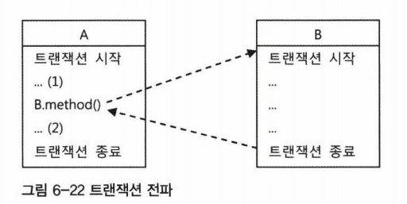

# 트랜잭션이란?

- 더 이상 쪼갤 수 없는 최소 단위의 작업
- 트랜잭션 경계 안에서 진행된 작업은 모두 성공하던지 모두 취소돼야 함

## 트랜잭션 동작 원리
### JDBC 트랜잭션

```java
Connection connection = dataSource.getConnection(); // 1

try (connection) {
    connection.setAutoCommit(false); // 2
    // execute sql statements
    connection.commit(); // 3
} catch (SQLException e) {
    connection.rollback(); // 4
}
```

1. DB 연결
2. Java에서 Transaction을 시작하는 `유일한`방법.
3. commit
4. 예외 발생시 rollback

### JDBC isolation levels and savepoints

**Spring의 @Transactional**

```java
@Transactional(propagation=TransactionDefinition.NESTED, isolation=TransactionDefinition.ISOLATION_READ_UNCOMMITTED)

Propagation propagation() default Propagation.REQUIRED;
Isolation isolation() default Isolation.DEFAULT;
```

**JDBC**

```java
connection.setTransactionIsolation(Connection.TRANSACTION_READ_UNCOMMITTED);

Savepoint savePoint = connection.setSavepoint();

connection.rollback(savePoint);
```

- `isolation`: 고립 레벨 지정
    - 트랜잭션들끼리 일관성있는 데이터를 얼마나 허용할 것인지 정해놓은 수준
    - 트랜잭션 수행 중 다른 트랜잭션이 해당 데이터를 조회하는 것이 가능한지의 정도를 결정
    - 고립 수준이 높을 수록 일관성은 보장, 동시성은 떨어짐 (성능 저하)
- `savepoints`: 하위 트랜잭션을 실현하기 위한 SQL 구문 중 하나
    - 트랜잭션의 즉정 지점에 이름을 지정하고, 그 지점 이전에 수행 한 작업에 영향을 주지 않고 그 지점 이후에 수행한 작업을 `rollback` 가능
    - 단일 트랜잭션에서 여러 `savepoint`를 만들 수 있음

### Spring Transaction Management

```java
@Service
@RequiredArgsConstructor
public class UserService {

    private final TransactionTemplate template;

    public Long registerUser(User user) {
        Long id = template.execute(status -> {
            // SQL
            return id;
        });
    }
}
```
`TransactionTemplate` 또는 `PlatformTransactionManger`를 이용

- DB 커넥션을 직접 열고 닫을 필요 없음 (트랜잭션 콜백 사용)
- SQLExceptions을 잡을 필요 없음 (스프링이 알아서 RuntimeException으로 변환)

### @Transactional Annotation

```java
@Service
public class UserService {

    @Transactional
    public Long registerUser(User user) {
        // SQL
        return id;
    }
}
```

```java
@EnableTransactionManagement
@Configuration
public class MySpringConfig { 
    
    @Bean
    public PlatformTransactionManager txManager() { 
        return transactionManger;
    } 
}
```

- SpringConfiguration에 `@EnableTransactionManagement` 애노테이션 붙임 (부트는 자동으로)
- SpringConfiguration에 트랜잭션 매니저 지정
- 스프링은 `@Transactional` 애노테이션이 달린 public 메서드에 대해서 내부적으로 트랜잭션 코드 실행

1. `@Transactional`이 있으면 JDBC에서 필요한 코드를 자동으로 삽입

## 스프링이 Transaction 코드를 삽입하는 방법

1. UserService, UserService의 `프록시` 인스턴스화
2. CGlib 라이브러리의 도움을 받아 `프록시`를 통해 코드를 넣은 것처럼 동작
3. 모든 트랜잭션 처리는 프록시가 아닌 `트랜잭션 매니저`에 위임하여 처리

-> 즉, `@Transactional` 애노테이션을 발견하면 해당 빈의 다이나믹 프록시를 만들고 해당 프록시 객체는 트랜잭션 매니저에 접근하여 **JDBC방식으로 코드를 실행**

## 트랜잭션 전파

- 트랜잭션의 경계에서 이미 진행 중인 트랜잭션이 있을 때 or 없을 때 어떻게 동작할지 결정하는 방식


-> 토비 스프링 6장

**공통 상황**

- A, B는 각각 독립적인 트랜잭션 경계를 가진 두 개의 코드다.
- A의 트랜잭션이 시작되고 끝나지 않은 시점에 B를 호출한다면?

**상황1**

- B의 코드가 새로운 트랜잭션을 만들지 않고 A에서 이미 시작한 트랜잭션에 참여
- B 작업이 끝나고 (2)에서 예외가 발생한다면?

-> A,B 트랜잭션이 묶여 있기 때문에 모든 DB 작업이 취소

**상황2**

- B의 트랜잭션을 A와 무관한게 독립적인 트랜잭션으로 만듬
- B 작업이 끝나고 (2)에서 예외가 발생한다면?

-> B 트랜잭션은 독자적으로 `commit` or `rollback`이 될것이라 B에는 영향 없음

### 트랜잭션 전파 설정(propagation)

- `REQUIRED`(default): 부모 트랜잭션이 존재하면 부모 트랜잭션으로 합류, 없으면 새로운 트랜잭션 생성 (즉 예외 발생시 모두 롤백)
- `REQUIRES_NEW`: 무조건 새로운 트랜잭션 생성 (롤백이 되어도 영향 없음)
- `MANDATORY`: 부모 트랜잭션에 합류, 없으면 예외
- `NESTED`: 부모 트랜잭션이 존재하면 중첩 트랜잭션 생성 (예외 발생시 중첩 트랜잭션의 시작 지점 까지만 롤백 / 커밋은 부모 트랜잭션이 커밋될 때)
- `NEVER`: 트랜잭션 생성 안함, 부모 트랜잭션 존재시 예외 발생
- `SUPPORTS`: 부모 트랜잭션이 있으면 합류, 없으면 트랜잭션 생성 X
- `NOT_SUPPORTED`: 부모 트랜잭션이 있으면 보류, 부모 트랜잭션이 없다면 트랜잭션 생성 X

---

### 참고

- https://jeong-pro.tistory.com/228
- 토비의 스프링