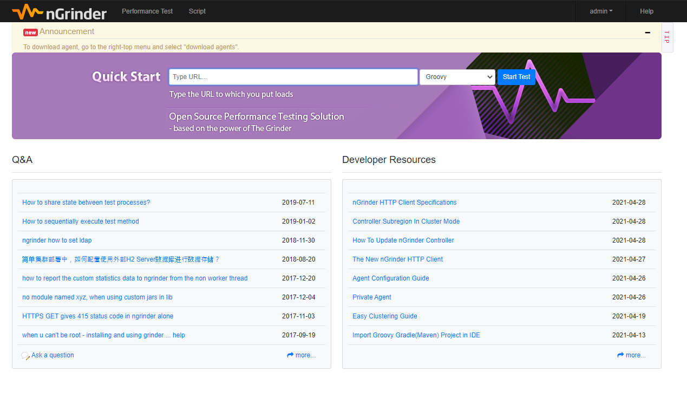
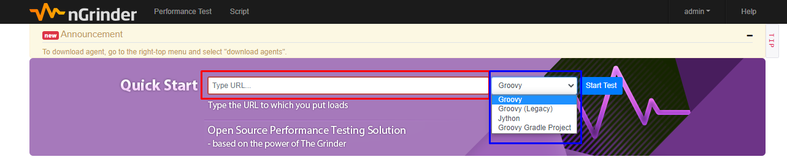
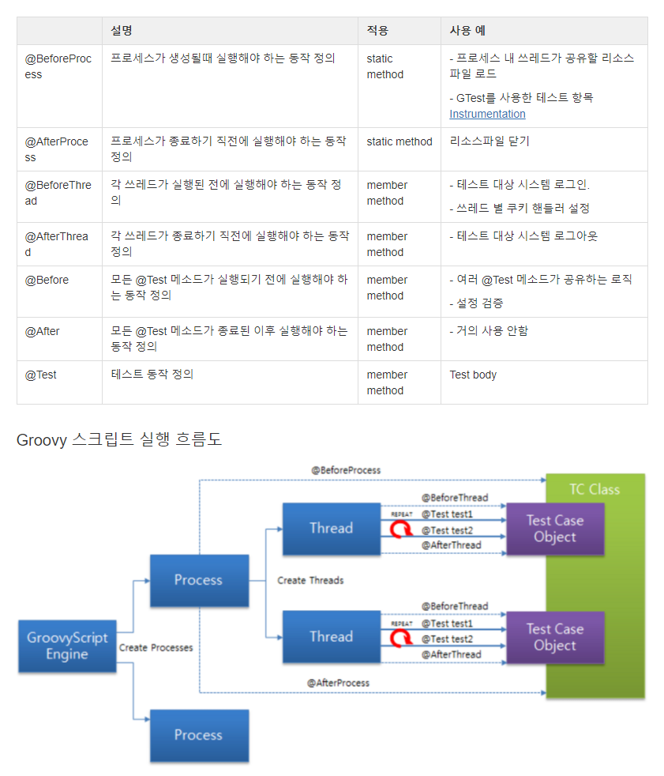
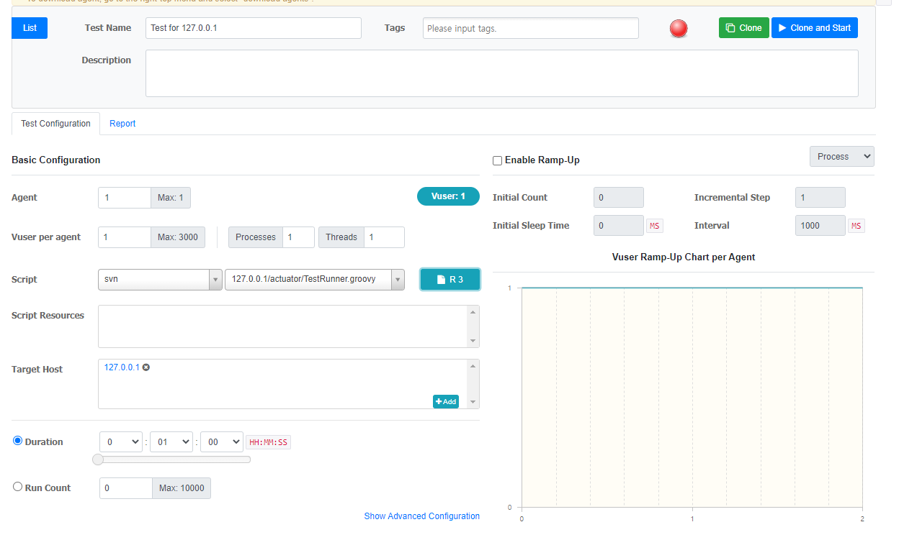
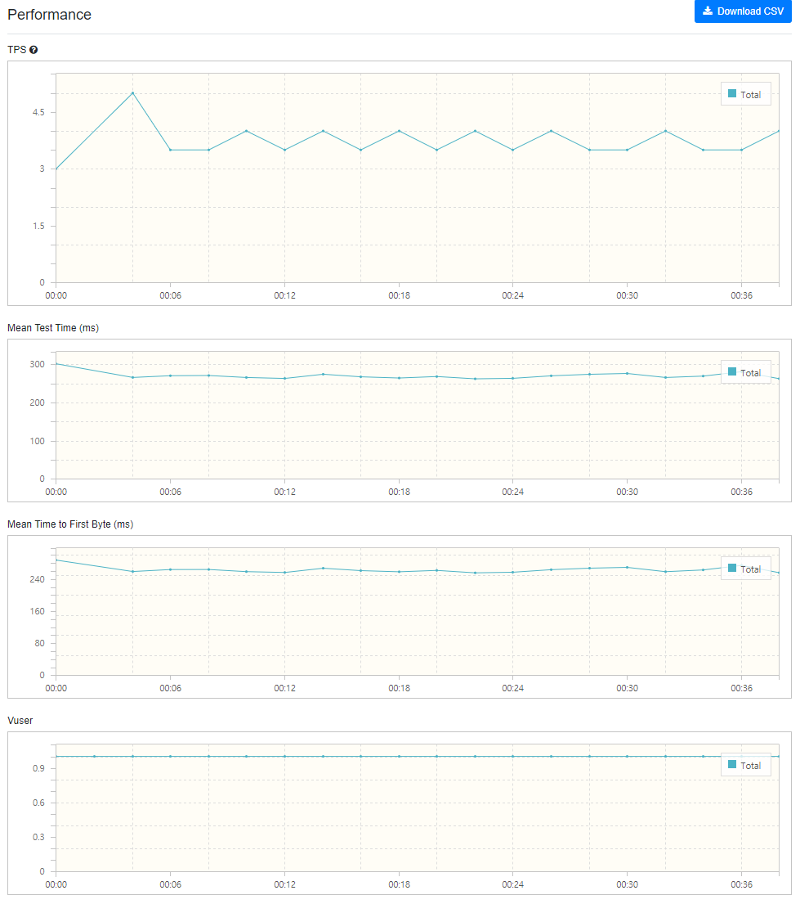

# 부하 테스트

## 부하 테스트의 목적

> 서비스 개발 이후 운영을 하기 직전 수행하는 테스트 중 하나로서, 실제 요구되는 부하를 서비스가 수용할 수 있는지를 확인하기 위한 작업

- 현재 서비스 구성의 `limit`를 찾기 위함
- 원하는 부하를 수용할 수 있게끔 구성되었는지 확인하기 위함
- 병목 지점을 찾고 병목 현상을 제거하기 위함

## 부하 테스트 단계

- 비결합된 개별 컴포넌트에 대한 부하 테스트 : 각 컴포넌트 별 병목 현상을 빠르게 발견하고 수정 가능
- 내부 서비스에 대한 부하 테스트 : 로그 기록 서비스와 같이 높은 처리량이 요구되는 서비스나, 결제 서비스와 같이 전체 서비스 품질에 있어 중요한 내부 서비스를 대상으로 테스트 진행
- 외부 서비스에 대한 부하 테스트 : Facebook, Twitter 등의 소셜 서비스나 Google 등의 플랫폼에 대한 서비스들, 또는 푸시 알림 서비스 등의 외부 서비스를 대상으로 테스트 진행
- 전체 스택에 대해 부하 테스트 : 개별 컴포넌트들에 대한 테스트를 완료한 뒤, 컴포넌트간의 상호작용을 알기 위해 처음부터 끝까지 전체 스택에 대해서 테스트 진행

## 다양한 부하 테스트 도구 및 서비스

- ApacheBench
- Siege
- JMeter
- The Grinder
- Gatling
- Tsung
- Bees
- Vegeta
- RedLine13
- Loader.io
- Goad

[부하테스트 도구 설명](https://ko.myservername.com/15-best-performance-testing-tools-2021)

# nGrinder

네이버에서 개발된 오픈소스 프로젝트로 서버 부하 테스트를 통해 성능을 측정할 수 있다.

## nGrinder의 장점

- 설치만 하면 사용하기 쉬움
- 예약, 모니터링, ramp up, 스크립트 기능 지원
- docker에서 사용 가능

-> Thread 기반으로 구현되어 있어 성능과 동시성에 대해 제한이 있다고 함

## nGrinder의 구성 요소


- nGrinder 서버
    - 에이전트와 타겟 등을 관리하고 스크립트를 작성할 수 있는 기능을 제공하는 웹 서버
    - 퍼포먼스 테스팅(부하테스트)를 위해 웹 인터페이스를 제공
    - 테스트 프로세스를 체계화
    - 테스트 결과를 수집해 통계로 보여줌
- nGrinder 에이전트
    - agent 모드가 실행 될 때 target이 된 머신에 프로세스와 스레드를 발생시켜 부하를 발생
    - moniter 모드가 실행되면 대상 시스템의 cpu와 memory를 모니터링
- 타겟
    - 부하테스트를 받는 머신

## nGrinder Docker-Compose

```yaml
version: '3.5'
services:
  controller:
    image: ngrinder/controller
    restart: always
    ports: 
      - "1000:80"
      - "16001:16001"
      - "12000-12009:12000-12009"
    volumes:
      - /mnt/swarm/ngrinder-controller:/opt/ngrinder-controller

  agent:
    image: ngrinder/agent
    restart: always
    links:    
      - controller
```



- 초기 ID/PW : admin/admin
- yaml 보면 포트가 여러개 있음
    - 16001은 테스트 하지 않은 에이전트가 컨트롤러에게 "할 일없으니 테스트 가능"이란 메세지를 알려주는 포트
    - 또는 "테스트가 실행하는데 해당 테스트는 1200x에서 발생하니, 해당 포트에 접속해서 테스트 실행 준비"라는 메세지를 에이전트에게 지시
    - 12000~1200x 포트는 "테스트 실행, 테스트 종료"와 같은 컨트롤러 명령어와 에이전트별 테스트 실행 통계를 초별로 수집하는 포트

## 부하 테스트



- 빨간색 박스에 테스트하고싶은 웹사이트 주소 입력
- 파란색 박스에 테스트할 스크립트 언어 선택

### Groovy Script

> Groovy는 자바에 파이썬, 루비, 스몰토크 등의 특징을 더한 동적 객체지향 프로그래밍 언어다.

**기본 부하테스트 스크립트**

```groovy
import static net.grinder.script.Grinder.grinder
import static org.junit.Assert.*
import static org.hamcrest.Matchers.*
import net.grinder.script.GTest
import net.grinder.script.Grinder
import net.grinder.scriptengine.groovy.junit.GrinderRunner
import net.grinder.scriptengine.groovy.junit.annotation.BeforeProcess
import net.grinder.scriptengine.groovy.junit.annotation.BeforeThread
// import static net.grinder.util.GrinderUtils.* // You can use this if you're using nGrinder after 3.2.3
import org.junit.Before
import org.junit.BeforeClass
import org.junit.Test
import org.junit.runner.RunWith

import org.ngrinder.http.HTTPRequest
import org.ngrinder.http.HTTPRequestControl
import org.ngrinder.http.HTTPResponse
import org.ngrinder.http.cookie.Cookie
import org.ngrinder.http.cookie.CookieManager

/**
* A simple example using the HTTP plugin that shows the retrieval of a single page via HTTP.
*
* This script is automatically generated by ngrinder.
*
* @author admin
*/
@RunWith(GrinderRunner)
class TestRunner {

	public static GTest test
	public static HTTPRequest request
	public static Map<String, String> headers = [:]
	public static Map<String, Object> params = [:]
	public static List<Cookie> cookies = []

	@BeforeProcess
	public static void beforeProcess() {
		HTTPRequestControl.setConnectionTimeout(300000)
		test = new GTest(1, "www.google.com")
		request = new HTTPRequest()
		grinder.logger.info("before process.")
	}

	@BeforeThread
	public void beforeThread() {
		test.record(this, "test")
		grinder.statistics.delayReports = true
		grinder.logger.info("before thread.")
	}

	@Before
	public void before() {
		request.setHeaders(headers)
		CookieManager.addCookies(cookies)
		grinder.logger.info("before. init headers and cookies")
	}

	@Test
	public void test() {
		HTTPResponse response = request.GET("https://input-url.com/", params)

		if (response.statusCode == 301 || response.statusCode == 302) {
			grinder.logger.warn("Warning. The response may not be correct. The response code was {}.", response.statusCode)
		} else {
			assertThat(response.statusCode, is(200))
		}
	}
}
```


[출처](https://brownbears.tistory.com/27?category=168280)

- `@BeforeProcess` : 모든 쓰레드가 공유할 데이터를 정의하기 좋음
    - `GTest`는 각 테스트의 통계를 수집할때 사용하는 클래스
    - `request` 인스턴스의 바이트 코드를 조작해 레코딩하도록 설정
- `@BeforeThread` : 쓰레드가 시작되기 전 실행 될 코드를 작성
    - 보통 로그인과 같은 테스트 사전 처리 코드 작성

### Test Configuration



- `Agent`는 Controller와 연결되어 있는 Agent 수 만큼 사용 가능
- `Vuser`는 가상 사용자로 Process * Thread 로 계산
- `Script`는 사용자가 해당 주소로 부하를 걸 스크립트를 보여줌
- `Ramp-Up`은 점차 부하를 가할 수 있는 기능 (process나 thread를 늘림)
    - `Initial Count`는 처음 시작할 때 vuser의 수를 설정
    - `Initial Sleep Time`은 테스트를 언제부터 실행시킬 지 설정
    - `Incremental Step`은 해당 Process/Thread를 몇 개 씩 증가시킬지 설정
    - `Interval`은 설정한 것들의 증가 시간을 설정

### 테스트 완료 화면

